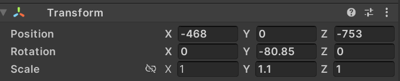

# Trajectory Analysis

## Explanation about coordinate system:

The coordinates of player are extracted from the unity component "Transform" {alt="Example in unity"}

The coordinate origin and coordinate system are shown in the figure:{alt="Example in unity"}

Recording frequency: Every 0.5 second.

## Data preprocess:

1\. copy the raw data to a new "workfiles" folder

```{r}

library(tidyverse)
library(fs)

# Define the folder paths
log_folder <- "log_files"
working_folder <- "workfiles"

# Create the working folder if it doesn't exist
dir_create(working_folder)

# Copy files from log_files to the working folder
files_to_copy <- dir_ls(log_folder)
for (file in files_to_copy) {
  file_copy(file, file.path(working_folder, basename(file)))
}


```

2\. Clean_up the data

```{r}
# for participant 17 s3t3, there were 3 taskaccpeted because the participant set the wrong destination 2 times, should delete two meaningfulless taskaccepted(Found that also duplicated setNavitaion, but it will not cause influence to the results)

data <- read.csv("workfiles/participant_17_scenario_3_s_at_2023.09.28_11.33.58.csv", sep = ";")

taskAccept_indices <- which(data$taskState == "taskAccepted")
indices_to_replace <- taskAccept_indices[4:5]
# Replace "taskAccept" with empty string ("")
data$taskState[indices_to_replace] <- ""  

# Write the modified data back to the CSV file
write.table(data, file = "workfiles/participant_17_scenario_3_s_at_2023.09.28_11.33.58.csv", sep = ";", row.names = FALSE, col.names = TRUE, quote = FALSE)

##### same as 27 s1t3
data <- read.csv("workfiles/participant_27_scenario_1_w_at_2023.10.04_16.40.08.csv", sep = ";")

taskAccept_indices <- which(data$taskState == "taskAccepted")
indices_to_replace <- taskAccept_indices[4]
data$taskState[indices_to_replace] <- ""  

write.table(data, file = "workfiles/participant_27_scenario_1_w_at_2023.10.04_16.40.08.csv", sep = ";", row.names = FALSE, col.names = TRUE, quote = FALSE)

##### same as 27 s3t3
data <- read.csv("workfiles/participant_27_scenario_3_e_at_2023.10.04_16.15.54.csv", sep = ";")

taskAccept_indices <- which(data$taskState == "taskAccepted")
indices_to_replace <- taskAccept_indices[4]
data$taskState[indices_to_replace] <- ""  

write.table(data, file = "workfiles/participant_27_scenario_3_e_at_2023.10.04_16.15.54.csv", sep = ";", row.names = FALSE, col.names = TRUE, quote = FALSE)

##### same as 38 s3t1
data <- read.csv("workfiles/participant_38_scenario_3_w_at_2023.10.11_16.40.07.csv", sep = ";")

taskAccept_indices <- which(data$taskState == "taskAccepted")
indices_to_replace <- taskAccept_indices[2]
data$taskState[indices_to_replace] <- ""  

write.table(data, file = "workfiles/participant_38_scenario_3_w_at_2023.10.11_16.40.07.csv", sep = ";", row.names = FALSE, col.names = TRUE, quote = FALSE)

##### same as 44 s1t4
data <- read.csv("workfiles/participant_44_scenario_1_s_at_2023.10.13_16.29.40.csv", sep = ";")

taskAccept_indices <- which(data$taskState == "taskAccepted")
indices_to_replace <- taskAccept_indices[5]
data$taskState[indices_to_replace] <- ""  

write.table(data, file = "workfiles/participant_44_scenario_1_s_at_2023.10.13_16.29.40.csv", sep = ";", row.names = FALSE, col.names = TRUE, quote = FALSE)

##### same as 45 s3t3
data <- read.csv("workfiles/participant_45_scenario_3_s_at_2023.10.17_11.09.23.csv", sep = ";")

taskAccept_indices <- which(data$taskState == "taskAccepted")
indices_to_replace <- taskAccept_indices[4]
data$taskState[indices_to_replace] <- ""  

write.table(data, file = "workfiles/participant_45_scenario_3_s_at_2023.10.17_11.09.23.csv", sep = ";", row.names = FALSE, col.names = TRUE, quote = FALSE)

##### same as 62 s2t4
data <- read.csv("workfiles/participant_62_scenario_2_n_at_2023.10.27_16.31.15.csv", sep = ";")

taskAccept_indices <- which(data$taskState == "taskAccepted")
indices_to_replace <- taskAccept_indices[5]
data$taskState[indices_to_replace] <- ""  

write.table(data, file = "workfiles/participant_62_scenario_2_n_at_2023.10.27_16.31.15.csv", sep = ";", row.names = FALSE, col.names = TRUE, quote = FALSE)


#####  32 s1t2 there were 2 taskaccpeted with no reason 
data <- read.csv("workfiles/participant_32_scenario_1_e_at_2023.10.06_11.00.18.csv", sep = ";")

taskAccept_indices <- which(data$taskState == "taskAccepted")
indices_to_replace <- taskAccept_indices[3]
data$taskState[indices_to_replace] <- ""  

write.table(data, file = "workfiles/participant_32_scenario_1_e_at_2023.10.06_11.00.18.csv", sep = ";", row.names = FALSE, col.names = TRUE, quote = FALSE)

#####  59 s3t3 there were no tcheckedin because used F9, replace F9 with CheckedIn_migros 
data <- read.csv("workfiles/participant_59_scenario_3_e_at_2023.10.26_15.53.32.csv", sep = ";")

taskAccept_indices <- which(data$taskState == "DEBUG_IGNORE_ME: GameStart::scenario_selected.gameTasks.Count = 1")
indices_to_replace <- taskAccept_indices[1]
data$taskState[indices_to_replace] <- "checkedIn:migros"  

write.table(data, file = "workfiles/participant_59_scenario_3_e_at_2023.10.26_15.53.32.csv", sep = ";", row.names = FALSE, col.names = TRUE, quote = FALSE)


```

## Data process:

In this part, I processed the raw data and got the new variables about the trajectory analysis.

They are about length, time, speed, stops, stop time. (Because each participant had 4 tasks each scenario, I calculate length, time, stops, stop time of separate task also the sum of them, taking into account that this makes more sense as well as to prepare for future analysis.) I will give explanations about them respectively.

### Workflow:

1.  Initialize a new empty data frame to store the results and store it as a new csv file for the further analysis.
2.  Use a loop to go through each CSV file.
3.  Initialize new vectors to store length, time, stops, stop time, (speed can be calculated with length and time easily).
4.  Use task_accepted_indices and end_index to separate each task and get a subset for each task.
5.  Calculate length.
6.  Calculate time.
7.  Calculate walking stops.
8.  Calculate walking stop time.
9.  Extract the participant information from file name.
10. Get the result.
11. Store as new file.

### Calculate length:

Calculate Euclidean distances between consecutive points in the trajectory then sum them.

### Calculate time:

Extract the start time and end time for each task which is the DateTime from the first point and last point of the subset. Get time duration for each task then sum them.

### Calculate walking stops:

If the coordinates are the same among consecutive points, I regard these consecutive points as a walking stop.

### Calculate walking stop time:

Use stop_indices and start_indices to get the start point and end point of each walking stop. Then calculate the time of each walking stops then sum them.

```{r pressure, echo=FALSE}

#1.Initialize an empty data frame to store the results
result_df <- data.frame(
  participantno = numeric(),
  scenario = numeric(),
  startpoint = character(),
  lg_1 = numeric(),
  lg_2 = numeric(),
  lg_3 = numeric(),
  lg_4 = numeric(),
  duration_1 = numeric(),
  duration_2 = numeric(),
  duration_3 = numeric(),
  duration_4 = numeric(),
  total_length = numeric(),
  total_duration = numeric(),
  total_speed = numeric(),
  num_stops_1 = numeric(),  
  num_stops_2 = numeric(),  
  num_stops_3 = numeric(),  
  num_stops_4 = numeric(),
  stops_duration_1 = numeric(),  
  stops_duration_2 = numeric(),   
  stops_duration_3 = numeric(),    
  stops_duration_4 = numeric(),  
  total_walkingstops = numeric(),
  stringsAsFactors = FALSE
)

#2.Use a loop to go through each CSV file
setwd("workfiles") 
csv_files <- list.files(pattern="\\.csv$", full.names=TRUE) 

for (csv_file in csv_files) {
  df <- read.csv(csv_file, sep = ";", header = TRUE)
  df$posX <- as.numeric(df$posX)
  df$posZ <- as.numeric(df$posZ)

  #3.Initialize new vectors to store length, time, stops, stop time
  trajectory_lengths <- numeric()
  trajectory_durations <- numeric()
  num_stops <- numeric()
  trajectory_stops_durations <- numeric()
  
  #4.Identify the indices of taskAccepted and checkedIn points
  task_accepted_indices <- which(df$taskState == "taskAccepted")
  checked_in_indices <- which(grepl("checkedIn", df$taskState))

  for (i in seq_along(task_accepted_indices)) {
    start_index <- task_accepted_indices[i]
    end_index <- checked_in_indices[i]
    trajectory_subset <- df[start_index:end_index, c("posX", "posZ", "DateTime")]
    
    #5.Calculate length.
      #Euclidean distances between consecutive points in the trajectory
    distances <- sqrt(diff(trajectory_subset$posX)^2 + diff(trajectory_subset$posZ)^2)
    trajectory_length <- sum(distances)
    trajectory_lengths <- c(trajectory_lengths, trajectory_length)
  
    #6.Calculate time.
      #Time duration of the trajectory in seconds
    start_time <- as.POSIXct(trajectory_subset$DateTime[1], format="%Y-%m-%d %H:%M:%S")
    end_time <- as.POSIXct(trajectory_subset$DateTime[nrow(trajectory_subset)], format="%Y-%m-%d %H:%M:%S")
    trajectory_duration <- as.numeric(difftime(end_time, start_time, units = "secs"))
    trajectory_durations <- c(trajectory_durations, trajectory_duration)
    
    #7.Calculate walking stops.
      #Count the number of walking stops
      #duplicated(trajectory_subset[c("posX", "posZ")]. It is TRUE for rows that have duplicated values
      #!duplicated(trajectory_subset[c("posX", "posZ")], fromLast = TRUE) It is TRUE for the last occurrence of each set of duplicated values and FALSE otherwise. The fromLast = TRUE argument ensures that the last occurrence is marked as TRUE.
    num_stops_in_trajectory <- sum(duplicated(trajectory_subset[c("posX", "posZ")]) & !duplicated(trajectory_subset[c("posX", "posZ")], fromLast = TRUE))
    num_stops <- c(num_stops, num_stops_in_trajectory)
    

    #8.Calculate walking stop time.
      # Identify the indices of walking stops
    stop_indices <- which(duplicated(trajectory_subset[c("posX", "posZ")]) & !duplicated(trajectory_subset[c("posX", "posZ")], fromLast = TRUE))
      # Calculate the duration of each stop
    stop_durations <- numeric()
    for (stop_index in stop_indices) {
      # Find the start index for the current stop
      start_index <- match(TRUE, trajectory_subset$posX[stop_index] == trajectory_subset$posX & trajectory_subset$posZ[stop_index] == trajectory_subset$posZ)
      stop_start_time <- as.POSIXct(trajectory_subset$DateTime[start_index], format="%Y-%m-%d %H:%M:%OS")
      stop_end_time <- as.POSIXct(trajectory_subset$DateTime[stop_index], format="%Y-%m-%d %H:%M:%OS")
      stop_duration <- as.numeric(difftime(stop_end_time, stop_start_time, units = "secs"))
      stop_durations <- c(stop_durations, stop_duration)
    }
  
    # Sum the durations to get the total stops duration for the trajectory
    trajectory_stops_duration <- sum(stop_durations)
    trajectory_stops_duration <- round(trajectory_stops_duration, 3)
    # Append the stops duration to the vector
    trajectory_stops_durations <- c(trajectory_stops_durations, trajectory_stops_duration)
    
    }

  #9.Extract the participant information from file name
  file_parts <- unlist(strsplit(csv_file, "_"))
  participant_no <- as.numeric(sub("participant_", "", file_parts[2]))
  scenario <- as.numeric(file_parts[4])
  start_point <- substr(file_parts[5], 1, 1)

  #10.Get the result.
  file_result <- data.frame(
    participantno = participant_no,
    scenario = scenario,
    startpoint = start_point,
    
    lg_1 = trajectory_lengths[1],
    lg_2 = trajectory_lengths[2],
    lg_3 = trajectory_lengths[3],
    lg_4 = trajectory_lengths[4],
    total_length = sum(trajectory_lengths),
    
    duration_1 = trajectory_durations[1],
    duration_2 = trajectory_durations[2],
    duration_3 = trajectory_durations[3],
    duration_4 = trajectory_durations[4],
    total_duration = sum(trajectory_durations),
    
    total_speed = sum(trajectory_lengths) / sum(trajectory_durations),
    
    num_stops_1 = num_stops[1],
    num_stops_2 = num_stops[2],
    num_stops_3 = num_stops[3],
    num_stops_4 = num_stops[4],
    total_walkingstops = sum(num_stops),
    
    stops_duration_1 = trajectory_stops_durations[1],  
    stops_duration_2 = trajectory_stops_durations[2],   
    stops_duration_3 = trajectory_stops_durations[3],    
    stops_duration_4 = trajectory_stops_durations[4],
    total_walkingstop_duration = sum(trajectory_stops_durations),
    
    stringsAsFactors = FALSE
  )
  result_df <- rbind(result_df, file_result)
  }

# Print or use the resulting data frame
print(result_df)


```

```{r}
# Load the here package
library(here)

# Write the resulting data frame to a CSV file in the project root directory
write.csv(result_df, file = here("trajectory_analysis.csv"), row.names = FALSE)

```

```{r}
# Define the folder path
folder_path <- "workfiles"

# Delete the folder
unlink(folder_path, recursive = TRUE)

```
